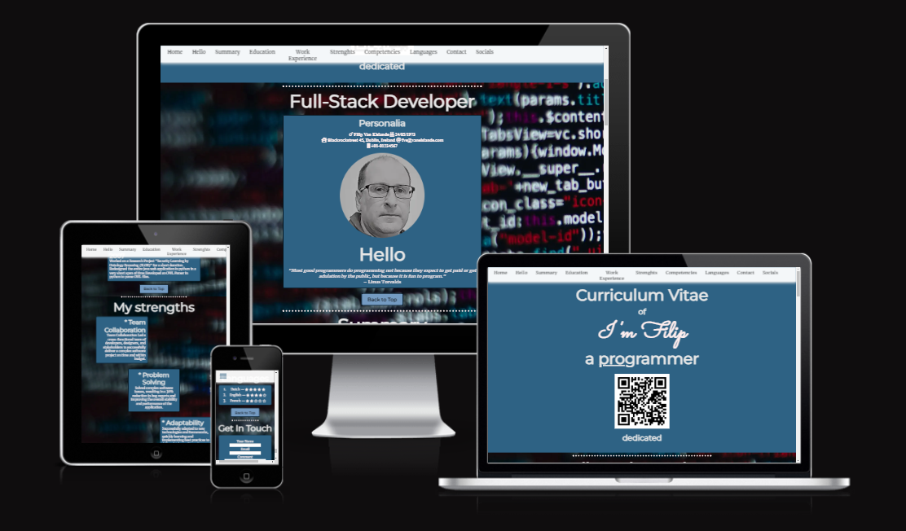

# Readme

A web CV, or web-based curriculum vitae, serves the same purpose as a traditional paper-based curriculum vitae (or 'CV' for short) but is presented online. It is essentially a digital representation of a person's professional and academic background, skills, achievements, and work experience. The primary purpose of a web CV is to showcase an individual's qualifications and accomplishments to potential employers, clients, or collaborators in a format that is easily accessible through the internet.

This site is intended for future employers or recruiters and should be a kind of calling card with direct access to all necessary information.

## Features
  
1. Navigation   
   * A navigation bar, often abbreviated as "nav bar," serves as a user interface element on a website or application. Its primary purpose is to provide a structured and easily accessible way for users to navigate through the different sections or pages of a website. 
   * The navigation bar is located at the top of a webpage or in a prominent position, and it contains links or buttons that direct users to various parts of the site.
   * There is also a "Back To Top" button included in each section of de webpage, so the user has easy access to go back to the top and access the "nav bar" again.   
 

1. Header - Landing Page
   * Because this is a 'web-CV' the QR code is a direct eyecatcher and gives a innovative idea to life whit a direct link to my personal website.
   * The color scheme consist of four colors and two additional colors for underling and highlighting. To make the colors match the creteria of Lighthouse some tweaking was neasary.
      
       Source: ColorHunt
      
   * The background image matches the chosen color scheme of five colors.
 
      

   * This image can be found on the Pexels: Pexels offers a vast library of free stock photos Free and Resources.
   * A sober but effective use of the screen welcomes the user to futher investagation and creates curiousity.
2. Section - Personalia
   * You have only one shot to give a good impression, so saying "Hello" to somebody is natural and confiviend, the black and white picture comes in a better contrast whit the rest of the color scheme.
   * To differsivy myself I included a quote of Linus Trovals
   * For most requiters to have immatly access to contact information is curcial 
 
   

3. Sections
   * The 'web-CV' has all the tradiontal elements included as paper based like version. In total there nine section. 

4. Section - My Strenghts
   * A first approche for demostration of responiveness, the hole webpage is build from the middle of the screen and is evenly distribute execpt for the 'navbar' to gives a more relax user experience where a lot reading needed. 
   * The division of three block from left to right that give more dynamic into the webpage.
   
   

1. Sections - Competenties & Languages
   * Here you can see that I used a lot of 'Font Awesome Icons', these are open source and free to use.  
   * Using a table to structure these Icons can be a little bit tricky when you go to very small sizes in responiveness.

      

   * Therefor its not recommend to make large or big table on dynamically webpages.

5. Section - Get In Touch
   * A basic contact form to send a note for whom a interrested are in further notice. 
   
   * When data filled in there will be a responds of the request code demostrating its functionallity.

9. Section - Socails
    * In a curriculum vitae the importence of socail media is in some cases very benificial. Every socail link opens in a sepperate webpage. 
    * To make the icons more vifit the icons highlight when hover over it this is same for the 'navbar' to make the top and bottom of the page consistent.

      

## Testing
* testatque corrupti quos dolores et quas molestias excepturi sint occaecati cupiditate non provident, similique sunt in culpa
* atque corrupti quos dolores et quas molestias excepturi sint occaecati cupiditate non provident, similique sunt in culpa
* atque corrupti quos dolores et quas molestias excepturi sint occaecati cupiditate non provident, similique sunt in culpa
  
# Bugs
* atque corrupti quos dolores et quas molestias excepturi sint occaecati cupiditate non provident, similique sunt in culpa
* atque corrupti quos dolores et quas molestias excepturi sint occaecati cupiditate non provident, similique sunt in culpa
  
## Validator Testing
* HTML
  * SDQQS dfssdfs fds fsd
* CSS
  * ezrzerzer 
* Accessibilty
  * g ffgfd  fgdfgzd dfg zdfg dfg dfzgdzfg zdfdgf dzfg df

screenshot lighthose

## Unfixed Bugs
sfdqdfsdqsdf sd sdfqsdfqsdf sdf qsd

# Deployment
* er zezea  fg sdfgsdf fg dsf sd sdfgsdfg dfdfg sdfg sdfg sdfg sdfgsdffgfsd gsdf
  * dfgdfgzdf dfg sdf
  * dfzg df gfdzzdfg zfg zdfg df
  * dfgfzdg dz dffgg  df dfzzdfg  fgzdgfg zdf g
  
fgdzgff dfgdfz dfz fgzdf gzdffgzdf gdfdfzfgddgaertet ertertert erfgsdfgsd f

# Credits

## Content
*   dfqdsf sdqfqsdf qs;lm,;: ,:rtgfplmdfkerzbjk erjnjklnfjkdqn sdnf klzerlmzesdqf qsdf sdfsdqf qsd
*   ds qqfsdqsdfqsdf

## Media
* sdqqsdf qsdfqsdfqsd qsd sdfqsd fsdf qsd fqsdf sdf,qsd;:f qsd:f ,qsd
  
  
The inspration for the design and concept of the web-CV have retained from the appbrewery (online learning platform) whit Angela Yu.