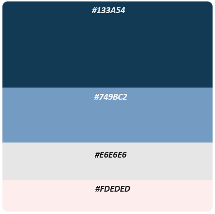
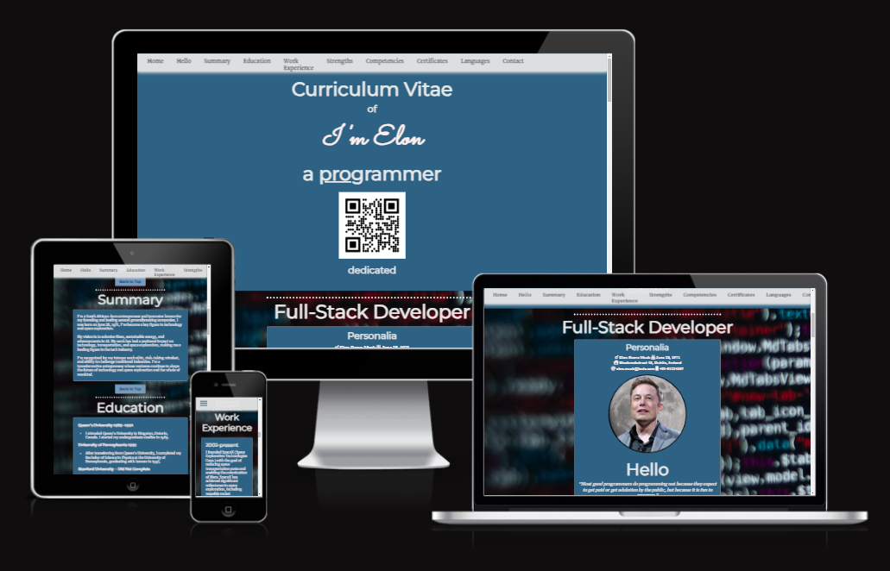
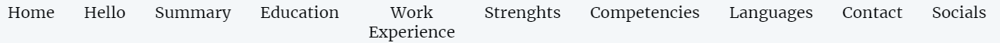
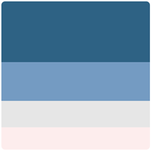
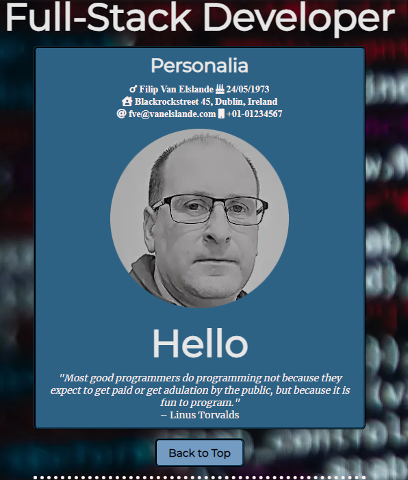
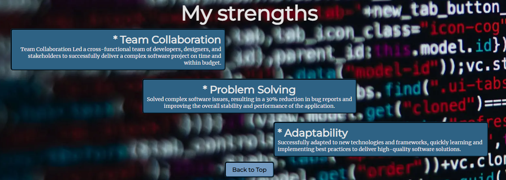
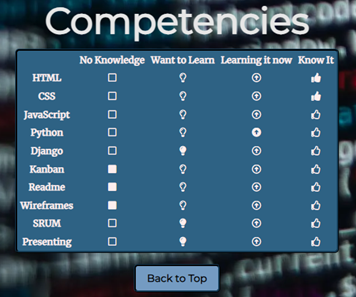
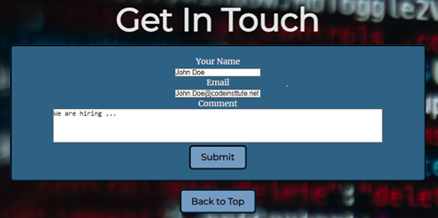
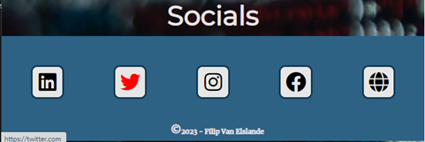
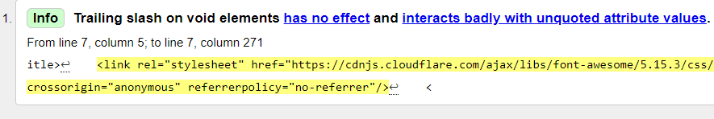

# The 'Web CV'

# Table of Contents

- [The 'Web CV'](#the-web-cv)
- [Table of Contents](#table-of-contents)
- [UX](#ux)
  - [Site owners Goals - 'WEB-CV Or 'Paper-CV'?](#site-owners-goals---web-cv-or-paper-cv)
    - [Web-based CV](#web-based-cv)
    - [Paper-based CV](#paper-based-cv)
  - [User Story - As a Recruiter](#user-story---as-a-recruiter)
    - [Acceptance Criteria](#acceptance-criteria)
  - [User Story - As a Job Seeker](#user-story---as-a-job-seeker)
    - [Acceptance Criteria](#acceptance-criteria-1)
- [Design](#design)
  - [Design Choices](#design-choices)
    - [Fonts](#fonts)
    - [Icons](#icons)
    - [Colors](#colors)
    - [Structure](#structure)
  - [Features](#features)
  - [Testing](#testing)
- [Bugs](#bugs)
  - [Validator Testing](#validator-testing)
  - [Unfixed Bugs](#unfixed-bugs)
- [Deployment](#deployment)
- [Credits](#credits)
  - [Content](#content)
  - [Media](#media)

# UX

## Site owners Goals - 'WEB-CV Or 'Paper-CV'?

### Web-based CV
* Pros
   - **Accessibility:** Can be viewed from anywhere with an internet connection.
   - **Interactivity:** Allows for multimedia elements and dynamic updates.
  - **Analytics:** Offers insights into CV views.
  - **Cost-effective:** No printing or postage expenses.  
* Cons
   - **Technical Issues:** Relies on internet connectivity.
   - **Security Concerns:** Potential susceptibility to breaches.
   - **Compatibility:** May face formatting issues on different devices.
   - **Digital Literacy:** Some employers may prefer traditional methods.
### Paper-based CV
* Pros
   - **Tangible Presence:** Creates a physical impression.
   - **Universal Acceptance:** Widely accepted across industries.
   - **Consistency:** Format remains constant without technical glitches.
   - **Traditional Preference:** Preferred in certain industries.

* Cons
   - **Limited Accessibility:** Less accessible for remote recruitment.
   - **Update Challenges:** Requires reprinting for updates.
   - **Environmental Impact:** Contributes to paper waste.
   - **Lack of Interactivity:** Cannot include multimedia elements.

## User Story - As a Recruiter
 I want to efficiently evaluate candidates by accessing their web-based CVs, allowing me to quickly assess their qualifications, skills, and professional experience. This will streamline the hiring process and enable me to make well-informed decisions.

### Acceptance Criteria
  1. As a recruiter, I should be able to access a candidate's web CV through a unique URL or QR code provided by the candidate.
  2. The web CV should provide a clear and well-organized layout, allowing me to easily navigate through sections such as Education, Work Experience, Skills, Projects, and Certifications.
  3. I want the ability to view a professional profile picture and contact information at the beginning of the web CV for quick reference.
  4. The candidate's professional summary or objective should be prominently displayed to provide a quick overview of their career goals.
  5. Each section of the web CV should offer concise and informative content, including job titles, dates, and key achievements in a clear and structured format.
  6. The web CV should be mobile-friendly, ensuring I can access and review it seamlessly on various devices.
  7. I expect the platform to provide basic analytics, such as the number of views and interactions with the candidate's web CV, to help gauge the candidate's online presence.
  8. The web CV platform should prioritize security and privacy, ensuring that sensitive candidate information is protected.
  9. The user interface should be intuitive, enabling me to quickly assess a candidate's qualifications and skills without unnecessary complexity.
  10. I want the option to easily contact the candidate directly through the web CV platform or save their contact details for future communication.
  11. The platform should allow me to provide feedback or comments on specific sections of the web CV to facilitate communication with other team members.

By meeting these criteria, the web CV platform will enhance the efficiency of my candidate evaluation process, ultimately leading to more informed hiring decisions.

## User Story - As a Job Seeker
"As a job seeker, I want to easily create and manage a web-based CV that allows me to present my skills, qualifications, and work experience in a visually appealing and professional manner. I want the CV to be easily accessible by potential employers and provide them with a comprehensive overview of my capabilities.

### Acceptance Criteria
  1. As a user, I should be able to sign up and log in to the web CV platform to create and manage my profile.
  2. I want the ability to input and update my personal information, including my name, contact details, and a professional profile picture.
  3. I need to be able to add multiple sections to my CV, such as Education, Work Experience, Skills, Projects, and Certifications.
  4. Each section should allow me to enter relevant details, such as job titles, dates, descriptions, and key achievements.
  5. The web CV should provide customizable templates or themes that allow me to choose a design that best represents my personal brand and professional style.
  6. I should be able to upload and showcase documents, such as my resume and portfolio, to provide additional context and detail.
  7. The platform should have an option to preview my CV before making it public to ensure it looks polished and professional.
  8. I want the ability to share a unique URL or QR code that directs employers to my web CV easily.
  9. The web CV should be mobile-friendly, ensuring that potential employers can access and view it seamlessly on various devices.
  10. As a user, I want the option to export my web CV as a PDF for offline sharing and printing purposes.
  11. The platform should include basic analytics, such as the number of views and interactions with my CV, to help me gauge its effectiveness.
  12. I expect the web CV platform to prioritize security and privacy, ensuring that my personal information is protected.

The user interface should be intuitive and user-friendly, allowing me to navigate and update my web CV with ease.

By fulfilling these bith criteria's, I aim to create a compelling and professional online presence that enhances my chances of securing job opportunities."

# Design

## Design Choices

### Fonts

I used a combination of classic and modern fonts to diversify myself, I've integrated [Google Fonts](https://fonts.google.com/ "Google Fonts") to find a typeface that complements the website's aesthetic. For the main text, I've opted for [Merriweather](https://fonts.google.com/specimen/Merriweather?query=mon "Merriweather font") due to its classic appearance. Its make it easy to read long sentences.
[Sacramento](https://fonts.google.com/specimen/Sacramento?query=mon "Sacramento font") I used for a eye catcher element in landing page, because it is a fuilid style it stands out of rest of the fonts and draws the attention to the reader.
To make headings stand out, I've applied with a "sans-serif" fallback.
The other fonts are more modern style and are typical used for headers and titles indicators [Poppins](https://fonts.google.com/specimen/Poppins?query=mon "Poppins font") & [Raleway](https://fonts.google.com/specimen/Raleway?query=mon "Raleway font") 

### Icons

As for icons I decided to use for my website [Font Awesome library](https://fontawesome.com/ "Font Awesome").

### Colors

As for colors I decided to use Color-Hunt. https://colorhunt.co

I will explain the uses of the various colors below, starting from top to bottom.

 
* #2E6284 : This is the main background color.
* #133A54 : This is the border color.
* #749BC2 : This is the accent color.
* #FDECEC : This is the seconary text color. (give a slide)
* #FDEDED : This is the main text color.
* #FF0000 : (red) hover effect.
  
### Structure
A center-style CV refers to a resume or curriculum vitae (CV for short) in which the content is aligned at the center of the page rather than the more traditional left-aligned format. This design choice can create a visually distinctive and modern look.

The Web-CV is espcailly trageting for mobile-first devices, because the center style is focusing on creating a visually appealing design for smaller screens.  

/////////
/
Its all about the User!

A web CV, or web-based curriculum vitae, serves the same purpose as a traditional paper-based curriculum vitae (or 'CV' for short) but is presented online. It is essentially a digital representation of a person's professional and academic background, skills, achievements, and work experience. The primary purpose of a web CV is to showcase an individual's qualifications and accomplishments to potential employers, clients, or collaborators in a format that is easily accessible through the internet.

This site is intended for future employers or recruiters and should be a kind of calling card with direct access to all necessary information.

## Features
  
1. Navigation   
   * A navigation bar, often abbreviated as "nav bar," serves as a user interface element on a website or application. Its primary purpose is to provide a structured and easily accessible way for users to navigate through the different sections or pages of a website. 
   * The navigation bar is located at the top of a webpage or in a prominent position, and it contains links or buttons that direct users to various parts of the site.
   * There is also a "Back To Top" button included in each section of de webpage, so the user has easy access to go back to the top and access the "nav bar" again.   
  

1. Header - Landing Page
   * Because this is a 'web-CV' the QR code is a direct eyecatcher and gives an innovative idea to life whit a direct link to my personal website.
   * The color scheme consists of four colors and two additional colors for underling and highlighting. To make the colors match the criteria of Lighthouse some tweaking was necessary.
      
       Source: Color-Hunt
      
   * The background image matches the chosen color scheme of five colors.
  
     

   * This image can be found on the Pixels: Pexels offers a vast library of free stock photos Free and Resources.
   * A sober but effective use of the screen welcomes the user to further investigation and creates curiosity.
  
2. Section - Personalia
   * You have only one shot to make a good impression, so saying "Hello" to somebody is natural and convenient, the black and white picture comes in a better contrast with the rest of the color scheme.
   * To diversify myself I included a quote of Linus Trovals.
   * For most requiters to have immediately access to contact information is crucial.
  
      
 
3. Sections
   * The 'web-CV' has all the traditional elements included as paper based like version. In total there nine section. 

4. Section - My Strenghts
   * A first approach for demonstration of responsiveness, the hole webpage is built from the middle of the screen and is evenly distributed except for the 'navbar' to give a more relax user experience where a lot reading needed. 
   * The division of three blocks from left to right that give more dynamic into the webpage.
 
   
 
5. Sections - Competenties & Languages
   * Here you can see that I used a lot of 'Font Awesome Icons', these are open source and free to use.  
   * Using a table to structure these Icons can be a little bit tricky when you go to very small sizes in responsiveness.

       

   * Therefor its not recommend to make large or big table on dynamic webpages.

6. Section - Get In Touch
   * A basic contact form to send a note for whom a interested are on further notice.

      

   * When data filled in, there will be a responds of the request code demonstrating its functionality.
 
7. Section - Socails
    * In a curriculum vitae the importance of social media is in some cases very beneficial. Every social link opens in a separate webpage.
    * To make the icons more visit the icons highlight when hover over it, this is same for the 'navbar' to make the top and bottom of the page consistent.
  
      

## Testing
* All the most conventional browsers were tested: Chrome, Opera, Firefox, Safari.
* This project is responsive, looks good on all known devices like smartphone, tablets and laptops.
* The navigation, header and contact text are all readable and easy to understand.
* The form contact section works in every field and only accept email in the email field and the submit button works.
  
# Bugs
* When deploying the project a bug was discovered but it had no impact on the functionality of the webpage!

   

  
## Validator Testing
* HTML
  *  No errors were returned when passing through the official [W3C validator]
* CSS
  * No errors were found when passing through the official [(Jigsaw) validator]

* Accessibilty
  * I confirmed that the colors and fonts chosen are easy to read and accessible by running it through lighthouse in devtools.

## Unfixed Bugs
* No issues whit bugs.

# Deployment
* This site is depolyed on GitHub pages.
  * In the correct GitHub repository, navigate to the Settings tab.
  * From the source selection take drop-down menu, select the Master Branch.
  * Once the master branch has been selected, the page provided the link to the completed website.
  
There is an active live link here: https://harmonica-men.github.io/web-CV/

# Credits

## Content
   * The inspiration for the design and concept of the web-CV have retained from the appbrewery (online learning platform) whit Angela Yu.

## Media
   * All media used on this site were free and open source.

