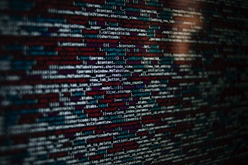

# Readme

A web CV, or web-based curriculum vitae, serves the same purpose as a traditional paper-based curriculum vitae (or 'CV' for short) but is presented online. It is essentially a digital representation of a person's professional and academic background, skills, achievements, and work experience. The primary purpose of a web CV is to showcase an individual's qualifications and accomplishments to potential employers, clients, or collaborators in a format that is easily accessible through the internet.

This site is intended for future employers or recruiters and should be a kind of calling card with direct access to all necessary information.

## Features
  
1. Navigation   
   * A navigation bar, often abbreviated as "nav bar," serves as a user interface element on a website or application. Its primary purpose is to provide a structured and easily accessible way for users to navigate through the different sections or pages of a website. 
   * The navigation bar is located at the top of a webpage or in a prominent position, and it contains links or buttons that direct users to various parts of the site.
   * There is also a "Back To Top" button included in each section of de webpage, so the user has easy access to go back to the top and access the "nav bar" again.   
  

1. Header - Landing Page
   * Because this is a 'web-CV' the QR code is a direct eyecatcher and gives an innovative idea to life whit a direct link to my personal website.
   * The color scheme consists of four colors and two additional colors for underling and highlighting. To make the colors match the criteria of Lighthouse some tweaking was necessary.
      
       Source: Color-Hunt
      
   * The background image matches the chosen color scheme of five colors.
  
     

   * This image can be found on the Pixels: Pexels offers a vast library of free stock photos Free and Resources.
   * A sober but effective use of the screen welcomes the user to further investigation and creates curiosity.
  
2. Section - Personalia
   * You have only one shot to make a good impression, so saying "Hello" to somebody is natural and convenient, the black and white picture comes in a better contrast with the rest of the color scheme.
   * To diversify myself I included a quote of Linus Trovals.
   * For most requiters to have immediately access to contact information is crucial.
  
      
 
3. Sections
   * The 'web-CV' has all the traditional elements included as paper based like version. In total there nine section. 

4. Section - My Strenghts
   * A first approach for demonstration of responsiveness, the hole webpage is built from the middle of the screen and is evenly distributed except for the 'navbar' to give a more relax user experience where a lot reading needed. 
   * The division of three blocks from left to right that give more dynamic into the webpage.
 
   
 
5. Sections - Competenties & Languages
   * Here you can see that I used a lot of 'Font Awesome Icons', these are open source and free to use.  
   * Using a table to structure these Icons can be a little bit tricky when you go to very small sizes in responsiveness.

       

   * Therefor its not recommend to make large or big table on dynamic webpages.

6. Section - Get In Touch
   * A basic contact form to send a note for whom a interested are on further notice.

      

   * When data filled in, there will be a responds of the request code demonstrating its functionality.
 
7. Section - Socails
    * In a curriculum vitae the importance of social media is in some cases very beneficial. Every social link opens in a separate webpage.
    * To make the icons more visit the icons highlight when hover over it, this is same for the 'navbar' to make the top and bottom of the page consistent.
  
      

## Testing
* All the most conventional browsers were tested: Chrome, Opera, Firefox, Safari.
* This project is responsive, looks good on all known devices like smartphone, tablets and laptops.
* The navigation, header and contact text are all readable and easy to understand.
* The form contact section works in every field and only accept email in the email field and the submit button works.
  
# Bugs
* When deploying the project a bug was discovered but it had no impact on the functionality of the webpage!

   

  
## Validator Testing
* HTML
  * This site passes 100% the official W3C validator test.
* CSS
  * There no errors to be found on W3C validator test.
* Accessibilty
  * I confirmed that the colors and fonts chosen are easy to read and accessible by running it through lighthouse in devtools.

## Unfixed Bugs
* No issues whit bugs.

# Deployment
* This site is depolyed on GitHub pages.
  * In the correct GitHub repository, navigate to the Settings tab.
  * From the source selection take drop-down menu, select the Master Branch.
  * Once the master branch has been selected, the page provided the link to the completed website.
  
There is an active live link here: https://harmonica-men.github.io/web-CV/

# Credits

## Content
   * The inspiration for the design and concept of the web-CV have retained from the appbrewery (online learning platform) whit Angela Yu.

## Media
   * All media used on this site were free and open source.

