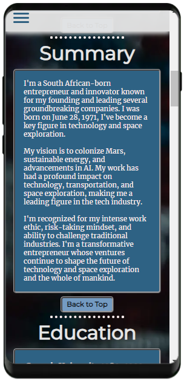
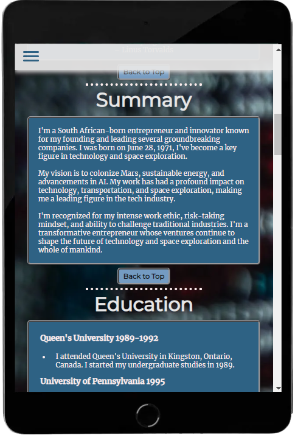
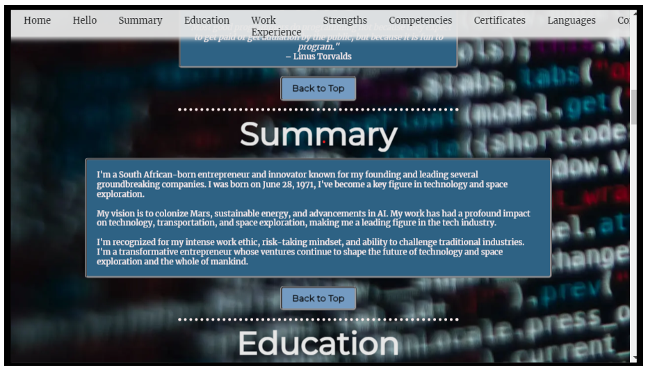
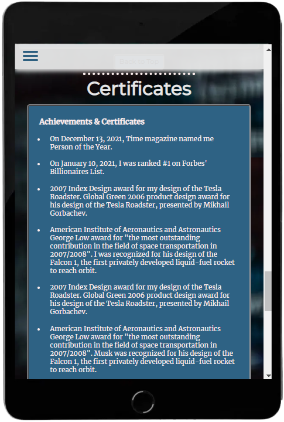

# The 'Web CV'

# UX

## Site owners Goals - 'WEB-CV Or 'Paper-CV'?

### Web-based CV

* Pros
   **Accessibility:** Can be viewed from anywhere with an internet connection.
   **Interactivity:** Allows for multimedia elements and dynamic updates.
   **Analytics:** Offers insights into CV views.
   **Cost-effective:** No printing or postage expenses.  
* Cons
   **Technical Issues:** Relies on internet connectivity.
   **Security Concerns:** Potential susceptibility to breaches.
   **Compatibility:** May face formatting issues on different devices.
   **Digital Literacy:** Some employers may prefer traditional methods.

### Paper-based CV

* Pros
   **Tangible Presence:** Creates a physical impression.
   **Universal Acceptance:** Widely accepted across industries.
   **Consistency:** Format remains constant without technical glitches.
   **Traditional Preference:** Preferred in certain industries.
* Cons
   **Limited Accessibility:** Less accessible for remote recruitment.
   **Update Challenges:** Requires reprinting for updates.
   **Environmental Impact:** Contributes to paper waste.
   **Lack of Interactivity:** Cannot include multimedia elements.

## User Story - As a Recruiter
 I want to efficiently evaluate candidates by accessing their web-based CVs, allowing me to quickly assess their qualifications, skills, and professional experience. This will streamline the hiring process and enable me to make well-informed decisions.

### Acceptance Criteria
  1. As a recruiter, I should be able to access a candidate's web CV through a unique URL or QR code provided by the candidate.
  2. The web CV should provide a clear and well-organized layout, allowing me to easily navigate through sections such as Education, Work Experience, Skills, Projects, and Certifications.
  3. I want the ability to view a professional profile picture and contact information at the beginning of the web CV for quick reference.
  4. The candidate's professional summary or objective should be prominently displayed to provide a quick overview of their career goals.
  5. Each section of the web CV should offer concise and informative content, including job titles, dates, and key achievements in a clear and structured format.
  6. The web CV should be mobile-friendly, ensuring I can access and review it seamlessly on various devices.
  7. The web CV platform should prioritize security and privacy, ensuring that sensitive candidate information is protected.
  8. The user interface should be intuitive, enabling me to quickly assess a candidate's qualifications and skills without unnecessary complexity.
  9. I want the option to easily contact the candidate directly through the web CV platform or save their contact details for future communication.
  10. The platform should allow me to provide feedback or comments on specific sections of the web CV to facilitate communication with other team members.

By meeting these criteria, the web CV platform will enhance the efficiency of my candidate evaluation process, ultimately leading to more informed hiring decisions.

## User Story - As a Job Seeker
"As a job seeker, I want to easily create and manage a web-based CV that allows me to present my skills, qualifications, and work experience in a visually appealing and professional manner. I want the CV to be easily accessible by potential employers and provide them with a comprehensive overview of my capabilities.

### Acceptance Criteria
  1. As a user, I should be able to sign up and log in to the web CV platform to create and manage my profile.
  2. I want the ability to input and update my personal information, including my name, contact details, and a professional profile picture.
  3. I need to be able to add multiple sections to my CV, such as Education, Work Experience, Skills, Projects, and Certifications.
  4. Each section should allow me to enter relevant details, such as job titles, dates, descriptions, and key achievements.
  5. I should be able to upload and showcase documents, such as my resume and portfolio, to provide additional context and detail.
  7. I want the ability to share a unique URL or QR code that directs employers to my web CV easily.
  8. The web CV should be mobile-friendly, ensuring that potential employers can access and view it seamlessly on various devices.  
  
The user interface should be intuitive and user-friendly, allowing me to navigate and update my web CV with ease.

By fulfilling these criteria, I aim to create a compelling and professional online presence that enhances my chances of securing job opportunities."
# Design

## Design Choices

### Fonts

I used a combination of classic and modern fonts to diversify myself, I've integrated [Google Fonts](https://fonts.google.com/ "Google Fonts") to find a typeface that complements the website's aesthetic. For the main text, I've opted for [Merriweather](https://fonts.google.com/specimen/Merriweather?query=mon "Merriweather font") due to its classic appearance. Its make it easy to read long sentences.
[Sacramento](https://fonts.google.com/specimen/Sacramento?query=mon "Sacramento font") I used for a eye catcher element in landing page, because it is a fuilid style it stands out of rest of the fonts and draws the attention to the reader.
To make headings stand out, I've applied with a "sans-serif" fallback.
The other fonts are more modern style and are typical used for headers and titles indicators [Poppins](https://fonts.google.com/specimen/Poppins?query=mon "Poppins font")

### Icons

As for icons I decided to use for my website [Font Awesome library](https://fontawesome.com/ "Font Awesome").

### Colors

As for colors I decided to use Color-Hunt. https://colorhunt.co

I will explain the uses of the various colors below, starting from top to bottom.

 

* #2E6284 : This is the main background color.
* #133A54 : This is the border color.
* #749BC2 : This is the accent color.
* #FDECEC : This is the seconary text color. (give a slide)
* #FDEDED : This is the main text color.
* #FF0000 : (red) hover effect.
  
### Structure
A center-style CV refers to a resume or curriculum vitae (CV for short) in which the content is aligned at the center of the page rather than the more traditional left-aligned format. This design choice can create a visually distinctive and modern look.

The Web-CV is espcailly trageting for mobile-first devices, because the center style is focusing on creating a visually appealing design for smaller screens.  

# Wireframes

I opted for [Balsamic](https://balsamiq.com/wireframes/ "Balsamic") for wireframing to visually structure and plan the layout and design of my website, aiming to provide a user-friendly experience and maintain design consistency across different devices.

The wireframes are below:

### [Desktop Wireframe](assets/wireframes/layout-desktop.png "Desktop wireframe")

### [Tablet Wireframe](assets/wireframes/layout-tablet.png "Tablet wireframe")

### [Phone Wireframe](assets/wireframes/layout-smart.png "Phone wireframe")

# Features

## Navigation Bar 

The responsive navigation bar remains fixed at the top, offering users effortless navigation throughout the website and ensuring an enhanced user experience.
   *  Desktop view > 768px

   * The utilization of a red hover effect serves to visually emphasize active, clicked, and hovered links, providing users with clear visual cues for their interactions with these elements.

 

   * small devices < = 768px
   * When the screen width hits 768 pixels or less, the navigation bar switches to a hamburger-style menu, ensuring responsiveness across various devices.

   * When pressed, it opens the main menu with all available links.

   * The code for the Hamburger Menu I used from
   * I has nice feature build in where burger seamlessly transition in to a cross element.

## Landing Page
   * Header - Landing Page
      * Because this is a 'web-CV' the QR code is a direct eyecatcher and gives an innovative idea to life whit a direct link to my personal website.
      * The color scheme consists of four colors and two additional colors for underling and highlighting. To make the colors match the criteria of Lighthouse some tweaking was necessary.
    

   * Section - Personal Data
     * You have only one shot to make a good impression, so saying "Hello" to somebody is natural and convenient. The black and white picture creates a better contrast with the rest of the color scheme.
     * To diversify myself, I included a quote from Linus Torvalds.
     * For most recruiters, immediate access to contact information is crucial.

  * Section -Summary
     * A quick overview of your carriere so far and a give a general idea of the person capabilities.

  * section - education
     * The details of the academic journey, including institutions attended, what degrees earned, and relevant coursework.
   

  * section - Work Experience
      * Chronological resentpretaton of the work history .

  * section - My Strenghts
      * To include emphatic socail capacaticy is a must-have element in the CV, to give the more granual appeal, this section is devide to 3 boxes on top of each other, from left to right.
      * In smaller view those boxes are stacked on top of each other.

   * section - Competenties
      * The masive use of font-aseome to exploiet to its full potential to give a quick and overseable table of the compententies
      * note: on smaller devices the table do not macht the complete witd of the screen therefor is a scroll overflow build to see the content more from the left or the right.
  

   * section - certificates
     * An additional overview of specific related job qualifaction can be in handy 
     * Also relevant achivements are important to reflect

   * section - languages
     * again the use of fontaseome is a easy way to show your laugages skills
   

   * section - contact
     * To leave information behind for a potential requiter is interesting, in this from you can fill in , name, email and comment
     * This section is also fully tested and sends a confirmation back

   
  
  
## Footer
   * socails
     * All the 5 biggest internet socails platform are represented in this part.
  

# Technologies 

## Languages
   * [HTML](https://en.wikipedia.org/wiki/HTML "HTML")
   * [CSS](https://en.wikipedia.org/wiki/CSS "CSS")

## Libraries & Frameworks
   * [Google Fonts](https://fonts.google.com/ "Google Fonts Libary")
   * [Font Awesome](https://fontawesome.com// "Font Awesome Libary")
 
## Tools
- [Balsamic](https://balsamiq.com/wireframes/ "Balsamic")
- [W3C HTML Validation Service](https://validator.w3.org/ "W3C HTML")
- [W3C CSS Validation Service](https://jigsaw.w3.org/css-validator/ "W3C CSS")
- [CSS Scan](https://getcssscan.com/css-box-shadow-examples "getcssscan.com")
- [ColorHunt](https://colorhunt.co/ "colorhunt")

# Testing

* The website has met the objectives set by all parties involved. It's responsive on various screen sizes, ensuring clean and crisp images without excessive empty space. Users can easily navigate and contact us through the contact form or social media. The content is concise, and the design is uncluttered, providing a user-friendly experience.

* While testing I didn't encounter any errors with the final project.
* HTML (index.html) validator [results](wireframes/W3C_validation_HTML.png "W3C HTML")
* CSS validator [results](wireframes/W3C_validation_CSS.png)

* The final project was tested using Google's Lighthouse on github pages. The results are below

 Performance test for Mobile:

Performance test for Desktop:

## Bugs

* There are no bugs to fix in the final project

# Deployment

After writing the code, committing, and pushing it to GitHub, the project was deployed using GitHub by following these steps:

* Go to the repository on GitHub and click on **Settings**

* In the side navigation, select **Pages**

* In the **None** dropdown, choose **main**

* Click the **Save** button.

* The website is now live at (https://harmonica-men.github.io/web-CV/)`

- If any changes are needed, you can make them, commit, and push to GitHub, and the updates will be reflected on the website.

[Back to Top](#table-of-contents)

# Credits

For images and content inspiration:

* [Angel Yu -- App Brewery](https://appbrewery.com/ "AppBrewery")
* [Pexels](https://pexels.com "Pexel")
* [hamburger menu](https://alvarotrigo.com/blog/hamburger-menu-css/ "hamburger menu")

